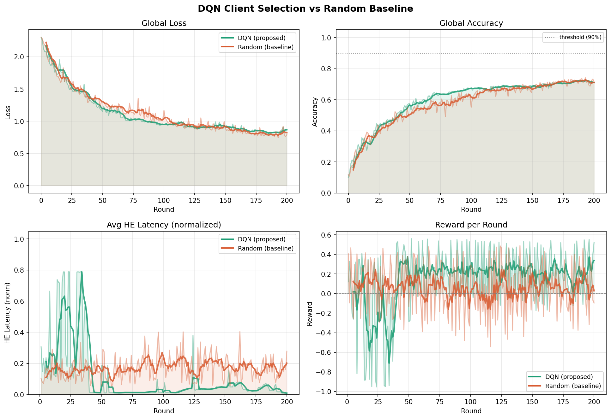
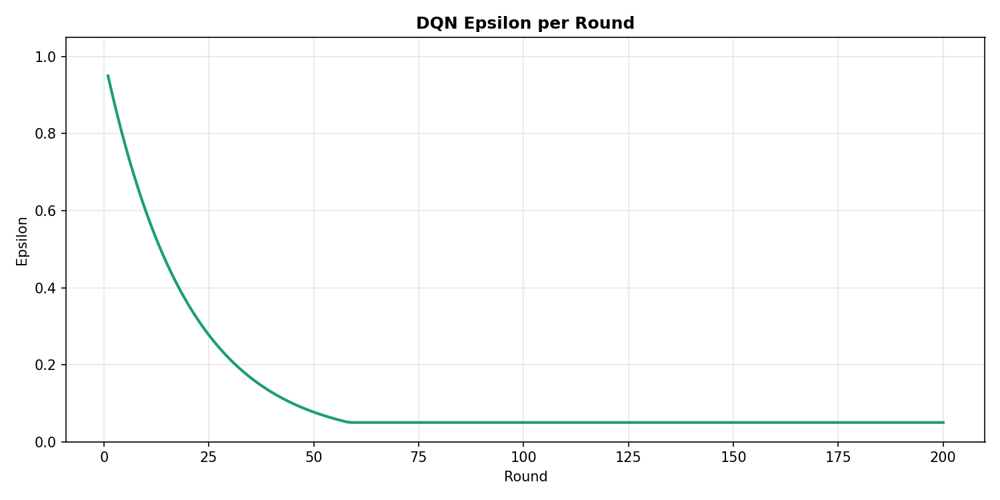

# 실험 보고서

## 1. Architecture
- 1 Cloud Server 100 clients
- 클라이언트에서 2번의 epoch 수행 후 서버로 전송, FedAvg 후 글로벌 모델 업데이트(Flower 프레임워크)

## 2. Dataset
- CIFAR-10
- non-IID: Dirichlet(alpha=0.5) 분포로 class 불균형

## 3. Clients Design
|그룹|수량|HE latency 분포|dropout 확률|특성|
|---|---|---|---|---|
|Excellent|5개|$N(0.02, 0.005)$|0.02|극단적으로 좋음|
|Fast|30개|$N(0.1, 0.02)$|0.05|빠름|
|Medium|30개|$N(0.5, 0.08)$|0.10|보통|
|Slow|25개|$N(1.5, 0.25)$|0.20|느림|
|Extreme|10개|$N(5.0, 0.50)$|0.40|극단적으로 나쁨|

```python
"""he_simulator.py"""
GROUP_CONFIG = {
    "excellent": {"mean": 0.02, "std": 0.005, "dropout": 0.02},
    "fast":      {"mean": 0.10, "std": 0.020, "dropout": 0.05},
    "medium":    {"mean": 0.50, "std": 0.080, "dropout": 0.10},
    "slow":      {"mean": 1.50, "std": 0.250, "dropout": 0.20},
    "extreme":   {"mean": 5.00, "std": 0.500, "dropout": 0.40},
}
```

### (a) Client Metrics
```python
"""client.py"""
metrics = {
    "loss":          float(loss),
    "accuracy":      float(accuracy),
    "train_latency": float(train_latency),
    "he_latency":    float(he_latency),
    "data_size":     len(self.train_indices),
    "dropped":       0,
    "cid":           self.cid,
}
```
### (b) Dropout
- **Dropout**: DQN이 선택했음에도 클라이언트가 글로벌 업데이트에 기여하지 못하는 상태

```python
"""he_simulator.py"""
def simulate_dropout(cid: int) -> bool:
    """
    그룹별 확률로 dropout 시뮬레이션
    True: 해당 라운드 탈락
    """
    group = get_group(cid)
    prob  = GROUP_CONFIG[group]["dropout"]
    return np.random.random() < prob
```

### (c) Client ID Mapping
```python
"""he_simulator.py"""
def get_group(cid: int) -> str:
    if cid < 5:    return "excellent"
    elif cid < 35: return "fast"
    elif cid < 65: return "medium"
    elif cid < 90: return "slow"
    else:          return "extreme"
```

### (d) Transmission Noise
- 전송 중 노이즈로 latency 발생
- 분포: $N(0, 0.01)$
```python
"""he_simulator.py"""
TRANSMISSION_NOISE_STD = 0.01
HE_LATENCY_MAX = 6.0
```

### (e) HE latency
- 매 라운드마다 HE latency 계산
- latency = HE latency + Transmission Noise
- max: 6.0
- [0, 1] 정규화: `float(np.clip(latency / HE_LATENCY_MAX, 0.0, 1.0))`
```python
"""he_simulator.py"""
TRANSMISSION_NOISE_STD = 0.01
HE_LATENCY_MAX = 6.0

def simulate_he_latency(base_latency: float) -> float:
    noise   = np.random.normal(0, TRANSMISSION_NOISE_STD)
    latency = base_latency + noise
    return float(np.clip(latency, 0.005, HE_LATENCY_MAX))
```

## 4. DQN
### (a) State
- $C^{(i)} = [h^{(i)}, d^{(i)}]$ 
- $h^{(i)} = \text{HE latency of i-th client}, \ d^{(i)} = \text{data size of i-th client}$

### (b) Action
- DQN output: 100개 clients 각각에 대한 score
- $Q(s, a) ≈ \frac{1}{k}\sum_{i∈a} \text{score}(i)$
```python
"""dqn.py"""
curr_scores = self.model(states_t)                        # [B, n_clients]
curr_q      = (curr_scores * actions_t).sum(1) / self.k_select
```

### (c) Reward
|Notation|의미|
|---|---|
|$R_t$|round $t$의 reward|
|$\Delta Acc_t$|accuracy 변화량|
|$\bar{Q_t}$|평균 quality bonus|
|$\bar{H_t}$|평균 HE latency|
|$D_t$|dropout rate|
|$k$|선택된 클라이언트수|
|$S_t$|round $t$에 선택된 클라이언트 집합|
|$d_i$|client $i$의 normalized data size|
|$h_i$|client $i$의 normalized HE latency|
|$B^{fast}_t$|fast bonus|
|$P^{slow}_t$|slow penalty|
|$h_i$|HE latency of i-th client|
|$d_i$|data size of i-th client|

$R_t = w_{acc}\Delta Acc_t + w_{q}\bar{Q_t} - w_{HE}\bar{H_t} - w_{drop}D_t + B^{fast}_t - P^{slow}_t$

#### where
$Q^{(i)} = d^{(i)} (1-h^{(i)})$<br>
$\bar{Q_t} = \frac{1}{k}\sum_{i \in S_t}Q^{(i)}$<br>
$\bar{H_t} = \frac{1}{k}\sum_{i \in S_t}H^{(i)}$<br>
$D_t=\frac{n^{drop}_k}{k}$<br>
$B^{fast}_t = \alpha \frac{n^{fast}_t}{k}, \ \alpha = 0.25$<br>
$P^{slow}_t = \beta \frac{n^{slow}_t}{k}, \ \beta = 0.20$<br>


```python
"""dqn_strategy.py"""
    reward = (
          w1 * acc_gain_norm       # Δaccuracy
        + w2 * avg_quality_bonus   # data size 크고 HE latency 낮을 수록 bonus 상승
        - w3 * avg_he_norm         # HE latency
        - w4 * dropout_rate        
        + fast_bonus               
        - slow_penalty             
    )
    return reward, curr_acc
```

# 실험 결과

## FL Hyperparameter
|parameter|value|
|---|---|
|rounds|200|
|num of clients|100|
|num of clients per round|10|
|batch size|32|
|learning rate|0.01|
|momentum|0.9|
|local epochs|2|

## DQN Hyperparameter
|parameter|value|
|---|---|
|discount factor $\gamma$|0.95|
|$\epsilon$ start|1.0|
|$\epsilon$ decay|0.95|
|$\epsilon$ min|0.05|
|batch size|32|
|memory size|5000|
|target update|5 step|

## 결과
| |DQN|Random|
|---|---|---|
|최종 Accuracy|0.7090|0.7299|
|최고 Accuracy|0.7196|0.7367|
|평균 HE latency|0.0888|0.1765|
|평균 Reward|0.1468|0.0497|

 
<br>


<br>

- 처음에는 random selection보다 리워드가 낮았으나 epsilon이 하강하는 50 round 근처에서부터 reward가 상승하기 시작함

### Ablation Study

| |DQN|DQN, $w_q=0$|Random|
|---|---|---|
|최종 Accuracy|0.7090|0.6840|0.7138|
|최고 Accuracy|0.7196|0.6975|0.7397|
- Reward 식의 Average Quality bonus $\bar{Q_t}$항의 계수 $w_q=0$으로 두고 실험 진행
- data size를 reward에 반영하였을 때 accuracy가 조금 더 높은 것을 확인할 수 있음