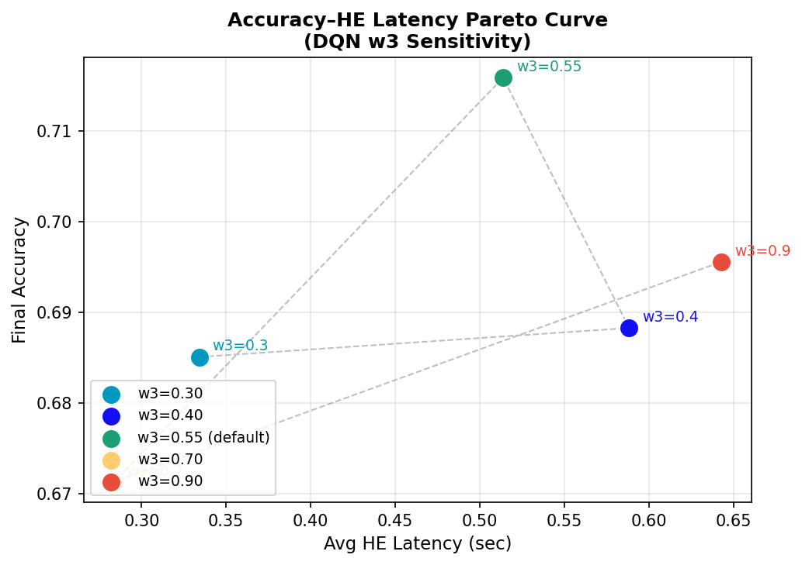
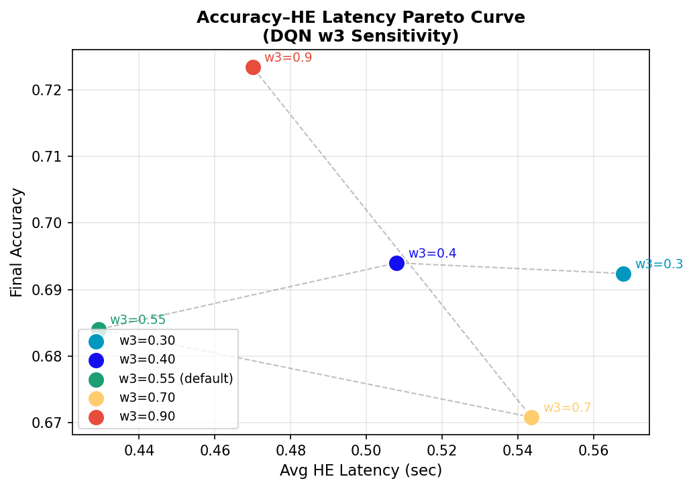
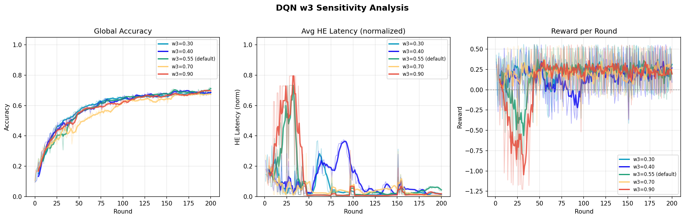
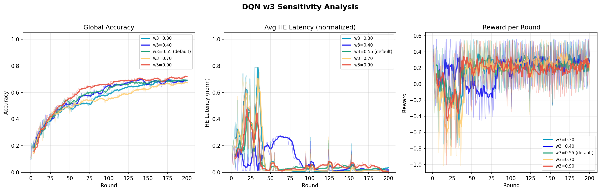

# w3값 변경 실험보고서
- $R_t = w_{acc}\Delta Acc_t + w_{q}\bar{Q_t} - w_{HE}\bar{H_t} - w_{drop}D_t + B^{fast}_t - P^{slow}_t$
- 리워드 식에서 $w_{HE}$ 값을 변경하며 실험 수행
- w3 = 0.3, 0.4, 0.55, 0.7, 0.9
- seed = 42, 123으로 총 두 세트 수행

## 결과

 

좌: seed=123 우: seed=42  

 
좌: seed=123 우: seed=42  

w3값 변경 실험에서 동일 w3 값임에도 랜덤 seed에 따라 결과가 크게 달라지는 것을 확인하였다. 현재 단계에서 w3값 비교는 의미가 없다고 판단하여, 실험을 중단하였다. 